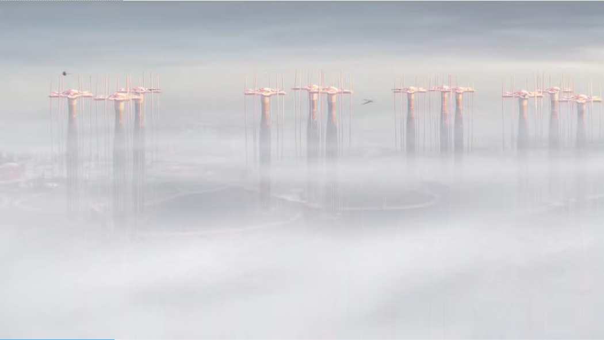

# Creative Coding Major Assignment-Individual Task for Perlin noise and randomness

## Instructions on interact of the work
In this project, I used p5.js to recreate the famous painting 'Saint Georges majeur au crépuscule' and added some new imaginative elements. You don't need to click or interact with the screen because it's a smooth animation.
- Once the animation loads, you will see the main building's color gradually changing.   Initially, it is purple, and slowly it transitions to dark gray.
- you can also see the background shandow's color changing. From gray to pink, very slowly.
- Surrounding it are rainbow-colored rings that sway and change size, twinkling as if the building is emitting light.
- You will see some seagulls flying above the sea.
- The sky and waves are also gently pulsating, with shimmering light reflecting on the water's surface.

## Details of individual approach
I choose perlin noise to drive my individual code, here is the detail instructions on the interact work.
### Color Transition Animation of the Main Building and background building
The building is a fixed element in the scene, with its color changing based on the noise value to simulate light and shadow effects. It serves as the central element of the scene, contrasting with the background and other dynamic elements such as the rainbow and seagulls.
Building on our group's code, I used Perlin noise values to gradually transition the main building's color from purple to black, symbolizing the shift from noon to dusk. Specifically, I used noise values to adjust the red and blue components of the purple channel while decreasing the brightness, achieving the color change of the building.
In addition, I used the same method to make the color of the building in the background slowly turn pink.

### Dynamic Effect of the Halo
The rainbow halo is positioned on the upper left side of the screen. It appears behind the building, with a gradient sky and sea in the background, creating a harmonious and ethereal visual effect. The rainbow always surrounds the main building, acting like the light produced by the building, making it a background element and adding visual depth to the scene.
The position and colors of the rainbow halo change with the Perlin noise value, dynamically adjusting its arc and thickness based on noise values.

### The Flying Effect of Seagulls
The seagulls are birds flying in the sky, using Perlin noise to achieve smooth motion paths. The each of these seagulls with unique initial positions, independently animate their wings with an oscillating motion. Some seagulls are larger and darker, while others are smaller and lighter-colored.
During each frame of the draw loop, the seagulls update their positions and are redrawn on the screen. Their positions dynamically adjust to screen resizing, maintaining visual appeal across different screen sizes.

## References to inspiration
Our group chose the world-famous painting "Saint Georges Majeur au Crepuscule" as our inspiration.    The painting captures a magnificent sunset, evoking a sense of beauty tinged with the melancholy of its fleeting nature.    This imagery brought to mind the works of Japanese science fiction writer 伊藤 計劃, particularly his novel "ハーモニー(harmony)."    In this work, Itoh depicts a utopian world—a city that is beautiful and harmonious yet filled with deceit.

Inspired by these themes, I envisioned a distant cityscape standing majestically across a shimmering sea in our project.    The buildings appear close yet distant, blending the clarity and brilliance of the city with an ethereal and elusive quality.    I aimed to create a scene that is both dazzling and dreamlike, evoking a sense of "物の哀れ"—the awareness of the transience of things and the gentle sadness that comes with it.

This inspiration guided my approach to the animation, where I sought to capture the juxtaposition of beauty and impermanence, crafting an atmosphere that is both mesmerizing and haunting.

 ## Short Technical Explanation
 Based on the team's code, I made the following changes:

1.The `Rainbow` class is designed to create a visual representation of a rainbow with dynamic properties using Perlin noise. Defines an array of colors representing the rainbow bands.
- The constructor initializes the position (`xPos`, `yPos`), the maximum radius of the rainbow (`maxRadius`), and the screen width (`screenWidth`).
- It also sets a random noise offset (`noiseOffset`) for independent noise generation, making each rainbow's properties unique.

2.The `Building` class is designed to represent a structure with dynamic color-changing properties using Perlin noise.  It allows for the building's color to smoothly transition between purple and black, simulating lighting or environmental changes.
- The constructor initializes the building's position (`xPos`, `yPos`) and its initial color values (R, G, B).
- It also sets a floating-point number between 0 and 1 generated by Perlin noise.
The red (R) and blue (B) channels are adjusted to transition between purple and black based on the noiseValue. Updates the building's color based on a Perlin noise value, creating a smooth transition effect.

3.The same method (with `Building` class) was used to add color variation to `backgroundshandow` class.

4.The `Seagull` class is designed to create a visual representation of a seagull with dynamic movement properties using Perlin noise.  This allows the seagull to move smoothly and naturally across the screen, simulating flight.

- The constructor initializes the position (x, y), dimensions (width, height), size, and color of the seagull. And add the wingAngle, wingSpeed to simulate wing flapping.
- Use the noiseOffsetX, noiseOffsetY to offsets random Perlin noise, creating smooth and varied movement in the x and y directions.
- Draws the left and right wings using beginShape(), vertex(), and endShape().  And updates the wingAngle to simulate continuous wing flapping. The move() method updates the seagull's position based on Perlin noise values.